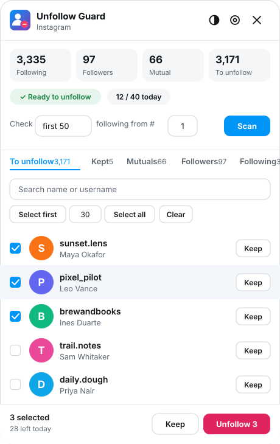
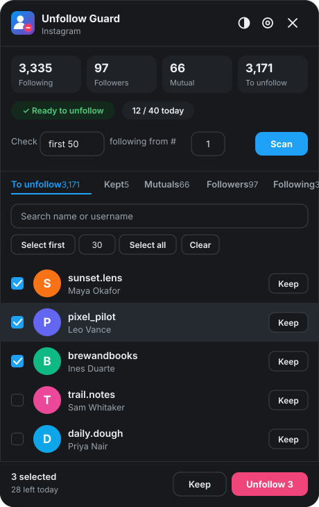
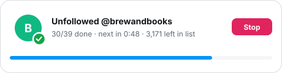
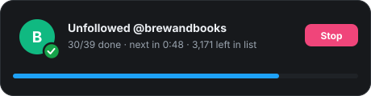
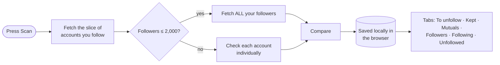
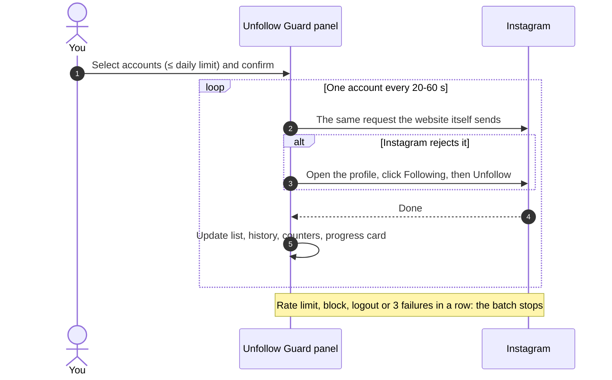

<div align="center">


<br>

[](LICENSE)
[](manifest.json)
[](#-installation)
[](manifest.json)
[](#-facebook-beta)

**[Features](#-features) · [Installation](#-installation) · [Quick start](#-quick-start) · [How it works](#-how-it-works) · [Safety](#-safety--limits) · [Privacy](#-privacy--permissions) · [Troubleshooting](#-troubleshooting)**

</div>

---

## 📖 Overview

**Unfollow Guard** is a Chromium extension that compares who you follow with who follows you back, shows the result in a clean in-page panel, and lets you unfollow the accounts you choose **slowly and in small batches**, the way a person would.

It was built for the very common situation of following thousands of accounts while only a few follow back, where unfollowing everyone at once is exactly what gets accounts rate-limited or blocked. So the extension is built around **control and restraint**:

- you decide who goes (and who is **kept** forever),
- it never selects more than your **daily limit**,
- every unfollow is spaced out with a **random delay**,
- and it **stops immediately** when Instagram pushes back.

> [!WARNING]
> Automating actions on Instagram or Facebook can go against their terms of service and can lead to temporary action blocks or restrictions. This project is **not affiliated with, endorsed by, or sponsored by Meta, Instagram or Facebook**. Use it at your own risk and read the [safety notes](#-safety--limits) first.

## 🖼 Preview

<div align="center">
<table>
<tr>
<td align="center"><br><sub><b>Light theme</b></sub></td>
<td align="center"><br><sub><b>Dark theme</b></sub></td>
</tr>
</table>

&nbsp;&nbsp;
<br><sub>The progress card stays at the top of the page while a batch runs: avatar, username, countdown and a Stop button.</sub>

<sub><i>Illustrations of the interface. Replace them with real screenshots in <code>docs/</code> whenever you like.</i></sub>
</div>

## ✨ Features

### 🔍 Find the non-followers
- **One-click scan** that compares your following list with your followers.
- **Scan only what you need**: the first 50 / 100 / 250 / 500 accounts you follow, or all, with a **"from #"** offset to continue where you stopped.
- **Accurate by design**: a partial following list is always compared against your *complete* followers (or each account is checked individually when you have a very large audience), so nobody who follows you is ever listed by mistake.
- **Follower changes**: every full scan is compared with the previous one, so you can see who unfollowed you and who followed you. A follower list that looks incomplete (it doesn't match Instagram's own count) is never compared, so nobody is reported as lost by mistake.
- **Separate data per account**: scans, kept lists, history and counters are stored for each logged-in account, so switching accounts never mixes them up.
- **Scan lock**: after every scan the button locks itself, so an accidental double-click can't send hundreds of requests. Unlock it deliberately in the settings.

### 🗂 Everything in tabs

| Tab | What you see |
| --- | --- |
| **To unfollow** | Accounts that don't follow you back, with checkboxes. |
| **Kept** | Accounts you chose never to unfollow. They stay out of every future scan and can be moved back at any time. |
| **Mutuals** | People you follow who follow you back. |
| **Followers** | Everyone who follows you (and whether you follow them back). |
| **Following** | Everyone you follow (and whether they follow you back). |
| **Unfollowed** | Your history of accounts unfollowed with the extension, with date and time. |
| **Changes** *(Instagram)* | **Who unfollowed you** and **who started following you** since your previous scan, with dates. |

Lists render in chunks, so even thousands of rows stay smooth. There is search on every tab, and the header shows live **Following / Followers / Mutual / To unfollow** counters.

### 🛡 Unfollow with guard rails
- **Daily limit** (default 40 on Instagram, 20 on Facebook, max 100): you *can't select more accounts than you have left today*.
- **Random delay** between unfollows (default 20–60 s).
- **Selections persist** across tab refreshes, browser restarts and reboots.
- **Keep button** on every row, plus **Keep selected** in bulk.
- **Time-left chip**: "Next unfollow in 0:48", "Ready to unfollow", or "Daily limit reached · resets in 5h 12m".
- **Stop button** that works instantly, even between page loads.
- **Stops by itself** on rate limits, action blocks, logouts, or after three failures in a row.
- **Cool-down after a block** (default 6 h): if the site blocks or rate-limits an action, unfollowing is paused for hours, even after a browser restart. You can end it early, after a warning.
- **Active hours** (optional): a batch only runs inside the time window you choose (windows that cross midnight, like 22:00–06:00, work too) and waits for it to open.
- **Activity log** that records every ✓ and ✗ with the reason.
- **Live progress card** with the avatar and username of the account being processed, and of the one just unfollowed.

### 🎨 Polished experience
- Custom in-page dialogs (no native browser popups).
- **Light, dark or system theme**, switchable from the panel header.
- **Draggable floating button**, or pin it to any corner from the settings.
- **On/off switch** in the toolbar popup. The icon shows an `OFF` badge while disabled.
- Beautiful, responsive layout that opens next to the button and never leaves the screen.

## 🚀 Installation

The extension isn't on a store; you load it as an unpacked extension. It works in **Chrome, Brave, Edge, Opera and other Chromium browsers (version 111 or newer)**.

1. **Download** this repository (or the zip) and **unzip** it somewhere permanent. Chromium remembers the folder, so don't move or delete it afterwards.
2. Open `chrome://extensions` (or `brave://extensions`, `edge://extensions`).
3. Turn on **Developer mode** (top-right).
4. Click **Load unpacked** and select the project folder (the one that contains `manifest.json`).
5. *(Optional)* Pin the extension from the puzzle-piece menu so the toolbar popup is one click away.
6. Open [instagram.com](https://www.instagram.com) or [facebook.com](https://www.facebook.com) and **refresh the tab**. A blue **Unfollow Guard** button appears in a corner.

> [!TIP]
> **Updating:** unzip the new version over the old folder, click the ↻ reload icon on the extension card, then **refresh your Instagram/Facebook tab**. Your saved scans, kept accounts and history stay in place.

## 🧭 Quick start

1. **Open the panel**: click the floating **Unfollow Guard** button (drag it wherever it doesn't get in the way).
2. **Scan**: choose how many accounts to check (for example *first 50*), then press **Scan** and confirm.
3. **Review**: go through **To unfollow** (and check **Changes** to see who unfollowed you since last time). Press **Keep** on anyone you never want to unfollow, and look at **Mutuals**/**Followers**/**Following** for the full picture.
4. **Select**: tick accounts by hand, or use **Select first** / **Select all** (limited to what's left of today's limit).
5. **Unfollow**: press **Unfollow N** and confirm. A progress card appears at the top of the page. Press **Stop** whenever you like.
6. **Come back tomorrow**: the counter resets at local midnight. To check the next batch, set **from #** to where you stopped, unlock **Allow scanning** in ⚙ Settings, and scan again.

## 🧠 How it works

### Scanning



Instagram's web app talks to its own JSON endpoints. The extension reads the same lists, from inside your logged-in session, at a gentle pace (pauses of 1–3 seconds between pages).

### Unfollowing



Two unfollow methods are available (⚙ Settings → *Instagram unfollow method*):

| Method | How it works | When to use it |
| --- | --- | --- |
| **Direct API** *(default)* | Sends the same request Instagram's own page sends, including the page's current security tokens, which a tiny script (`hook.js`) copies from the site's own requests. | Fast and quiet. If Instagram rejects it, the batch **automatically switches to Browser clicks** and says so in the log. |
| **Browser clicks** | Opens each profile and clicks **Following → Unfollow** like a person. The page reloads for each account and the batch resumes by itself. | Most robust. Requires Instagram's interface language to be **English** and the tab to stay open. |

### Resilience
- A batch **survives page reloads** and continues in the same tab. If the tab is closed for more than 5 minutes, the batch is abandoned rather than resuming unexpectedly.
- **Stop** is stored under its own key, so a running batch can never overwrite it.
- Large data (scan, lists) is cached in memory; small data (selection, kept, history, counters) is saved separately, so the interface stays fast.

## ⚙️ Settings

Open them from the **⚙** button in the panel or from the toolbar popup.

| Setting | Default | Description |
| --- | --- | --- |
| **Enable extension** | On | Hides the floating button everywhere when off. (Also on the toolbar popup.) |
| **Theme** | System | Light, dark, or follow the device. A quick-switch button is in the panel header. |
| **Button position** | Bottom right | Corner used when dragging is off, or after a reset. |
| **Allow dragging** | On | Drag the floating button anywhere; its spot is remembered per site. |
| **Instagram unfollow method** | Direct API | Direct API with automatic fallback, or Browser clicks only. |
| **Cool-down after a block** | 6 h | Pause unfollowing for this many hours after a block or rate limit (0 = off). |
| **Only unfollow during active hours** | Off | A batch waits until the window opens (your local time). |
| **Active hours** | 09:00 – 22:00 | The allowed window, used when the switch above is on. |
| **Allow scanning** *(per site)* | On → locks after a scan | Unlock to scan again. |
| **Daily unfollow cap** *(per site)* | 40 / 20 | 1–100 unfollows per day. Also limits how many accounts you can select. |
| **Delay between unfollows** | 20–60 s | A random value in this range is used each time. |
| **Saved scan** *(per site)* | – | Shows the saved scan of each account. **Clear** removes the saved lists. Kept accounts, unfollow history and the follower-change log are not affected. |

## 🛡 Safety & limits

The defaults are deliberately conservative. A few suggestions:

- **Start small.** A first batch of 10–20 accounts shows you how your account reacts.
- **Stay at or below ~40 a day** on Instagram. Many more can trigger temporary blocks.
- **Don't run it all day.** Do a batch, then use Instagram normally.
- **If you see a block message**, stop for a day or two. The extension already stops on its own and tells you why.
- **Keep your real friends safe**: use **Keep** liberally, and check **Mutuals** and **Followers**.
- **Facebook is stricter**; keep its limit low (see [Facebook beta](#-facebook-beta)).

At the default 40 a day, clearing about 3,000 accounts takes around 75 days. That is the point: it is slow *on purpose*.

## 🔒 Privacy & permissions

Everything stays **on your computer**, stored separately for each Instagram/Facebook account you use. The extension has no server, no analytics and no accounts, and it never sends your data anywhere except to Instagram/Facebook themselves, as part of the actions you ask for.

| Permission | Why it is needed |
| --- | --- |
| `storage` / `unlimitedStorage` | Saves your scans, kept list, selection, history and settings in the browser's local extension storage. Big lists can take a few MB. |
| Access to `instagram.com`, `facebook.com` | Required to show the panel and talk to those sites from your logged-in session. |

**About `hook.js`:** on Instagram a small script runs inside the page and *only observes* the site's own API requests to remember a few header values and the page token that the site itself uses (for example `x-ig-www-claim`, `fb_dtsg`). These values stay in the page and are used only to make the unfollow request look exactly like the site's own. They are never stored in your settings and never leave your browser.

You can inspect all of the code. There is no build step, no minification and no third-party dependency.

## 🧪 Facebook (beta)

Facebook support is a **beta feature and has not been tested much**. Facebook has no stable internal API like Instagram's, so the extension works on the page itself:

1. Open your profile's **Followers** tab and press **Collect followers**. The page scrolls by itself to load the list.
2. Open your **Following** tab and press **Collect following**.
3. The non-followers appear in the panel. Unfollowing is done by clicking the buttons on the **Following** tab.

Notes:
- Your **Followers** list only exists if *Who can follow me* is set to **Public** in your Facebook privacy settings.
- The "non-followers" list **includes Pages and public figures** you follow, since they never follow back. Review it before selecting.
- Facebook changes its page structure often; the page-matching code lives in [`facebook.js`](facebook.js) so it is easy to adjust. Text matching assumes an **English** interface.
- The default daily limit is **20**.

If something doesn't work, the **Activity log** and the browser console (`F12`) explain what the extension saw.

## 🧯 Troubleshooting

<details>
<summary><b>The floating button doesn't appear</b></summary>

- Refresh the Instagram/Facebook tab after installing or reloading the extension.
- Check the toolbar icon: if it shows an **OFF** badge, open the popup and switch **Enabled** on.
- Make sure you're on `www.instagram.com` or `www.facebook.com`.
</details>

<details>
<summary><b>I disabled the extension and can't get it back</b></summary>

Click the extension's icon in the browser toolbar and switch **Enabled** on. (Pin the extension from the puzzle-piece menu if you can't see it.)
</details>

<details>
<summary><b>"Scan locked"</b></summary>

By design: the scan locks after each run to prevent accidental repeats. Open ⚙ Settings, turn on **Allow scanning** for that site, then scan again.
</details>

<details>
<summary><b>"Cool-down is active"</b></summary>

The extension saw the site block or rate-limit an action and paused unfollowing (default 6 hours). The chip at the top shows the time left. Waiting is the safest option; you can end the cool-down early from the dialog, or change its length under ⚙ Settings → Safety.
</details>

<details>
<summary><b>The Changes tab is empty</b></summary>

The first full scan only saves a baseline. After your next scan, new followers and people who unfollowed you appear there. Scans that fetch your complete followers list are compared; if the list looks incomplete, the comparison is skipped for that scan.
</details>

<details>
<summary><b>Direct API unfollow gets rejected</b></summary>

The batch switches to Browser clicks automatically. If you want to avoid the attempt, choose **Browser clicks** in the settings. If neither works, check the Activity log and make sure you refreshed the tab after updating the extension (the helper script only starts when a page loads).
</details>

<details>
<summary><b>Browser clicks can't find the Following button</b></summary>

Instagram must be set to **English**. The error message lists the buttons it saw on the profile, which helps when Instagram changes its interface. Also make sure the account still exists and you actually follow it.
</details>

<details>
<summary><b>Profile pictures show a letter instead</b></summary>

Instagram's image links expire after a few days. Scan again to refresh them. Names and actions are unaffected.
</details>

<details>
<summary><b>Mutuals / Followers tabs are empty</b></summary>

Those lists are filled by a scan. If you have more than 2,000 followers and scanned a limited range, followers aren't fetched (each account is checked individually instead). Use **Check → all** for the full lists.
</details>

## 📁 Project structure

```text
.
├── manifest.json        # Manifest V3 definition, permissions and content scripts
├── background.js        # Service worker: shows the OFF badge on the toolbar icon
├── hook.js              # Runs in the Instagram page (MAIN world): observes the site's own request headers/tokens
├── shared.js            # Settings, storage helpers, dialogs, theme + shared styles and the settings form
├── instagram.js         # Instagram adapter: scan, direct API unfollow, browser-click unfollow
├── facebook.js          # Facebook adapter (beta): collect lists by scrolling, unfollow by clicking
├── content.js           # The panel UI: tabs, lists, selection, keep, progress card, resumable batch loop
├── popup.html / popup.js# Toolbar popup: enable switch and settings
├── icons/               # Extension icons (PNG + SVG source)
├── docs/                # README artwork
├── LICENSE              # MIT
└── README.md
```

Each site is an **adapter** that exposes the same small interface (`scan`, `unfollow`, `canScan`, `navigateTo`, …), so supporting another site means adding one file and registering it, with no changes to the UI.

## 🛠 Development

There is **no build step**: edit the files and reload.

```bash
# 1. edit any file
# 2. chrome://extensions  →  ↻ reload the extension
# 3. refresh the Instagram / Facebook tab

# quick syntax check of every script
for f in shared instagram facebook content popup background hook; do node --check $f.js; done
```

Tips:
- Console messages are prefixed with `[Unfollow Guard]`.
- All data lives in `chrome.storage.local`. Inspect it from the extension's service-worker console with `chrome.storage.local.get(null, console.log)`.
- Avoid naming top-level variables in extension pages after window properties (`top`, `name`, `status`…); they can stop a script from running.

## 🗺 Roadmap

- [x] Separate data for each logged-in account
- [x] **Changes** tab: who unfollowed you / who followed you
- [x] Cool-down after a block, and optional active hours
- [ ] Re-follow button on the **Unfollowed** tab
- [ ] Export / import the kept list and history (CSV / JSON)
- [ ] Localized button matching for Browser clicks
- [ ] Firefox build
- [ ] Optional "verified accounts" and "recently followed" safety filters
- [ ] Warm-up mode (raise the daily limit gradually)
- [ ] **Fans** tab (people who follow you that you don't follow) and simple statistics
- [ ] Real screenshots and a short demo video

## 🤝 Contributing

Issues and pull requests are welcome. For larger changes, please open an issue first to discuss what you'd like to change. Keep the guard rails (daily limit, delays, stop-on-block) intact; they are the point of the project.

## ⚠️ Disclaimer

This software is provided for personal use, **as is**, without warranty of any kind. You are solely responsible for how you use it and for any consequences for your accounts. It is an independent project and is not associated with Meta Platforms, Inc., Instagram or Facebook. All trademarks belong to their respective owners.

## 📄 License

Released under the [MIT License](LICENSE). Copyright © 2026 Mystic monk.

<div align="center">
<sub>Made with care for people who just want a tidier following list. 🧹</sub>
</div>
