<div align="center">

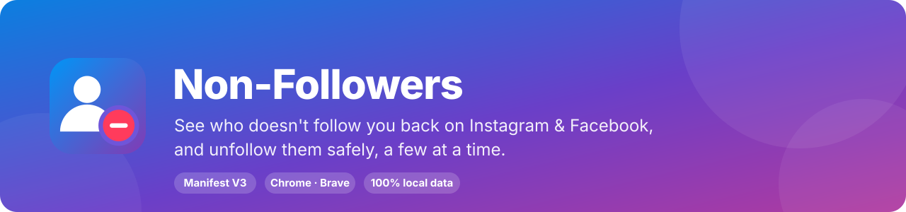

<br>

[](LICENSE)
[](manifest.json)
[](#-installation)
[](manifest.json)
[](#-facebook-beta)
[](#-firefox-experimental)
[](https://github.com/AshutoshSajan/unfollow-guard-extension/actions)

**[Features](#-features) · [Installation](#-installation) · [Quick start](#-quick-start) · [How it works](#-how-it-works) · [Safety](#-safety--limits) · [Privacy](#-privacy--permissions) · [Troubleshooting](#-troubleshooting) · [Development](#-development)**

</div>

---

## 📖 Overview

**Unfollow Guard** is a Chromium extension that compares who you follow with who follows you back, shows the result in a clean in-page panel, and lets you unfollow the accounts you choose **slowly and in small batches**, the way a person would.

It was built for the very common situation of following thousands of accounts while only a few follow back, where unfollowing everyone at once is exactly what gets accounts rate-limited or blocked. So the extension is built around **control and restraint**:

- you decide who goes (and who is **kept** forever),
- it never selects more than your **daily limit**,
- every unfollow is spaced out with a **random delay**,
- and it **stops immediately**, and cools down, when Instagram pushes back.

> [!WARNING]
> Automating actions on Instagram or Facebook can go against their terms of service and can lead to temporary action blocks or restrictions. This project is **not affiliated with, endorsed by, or sponsored by Meta, Instagram or Facebook**. Use it at your own risk and read the [safety notes](#-safety--limits) first.

## 🖼 Preview

<div align="center">

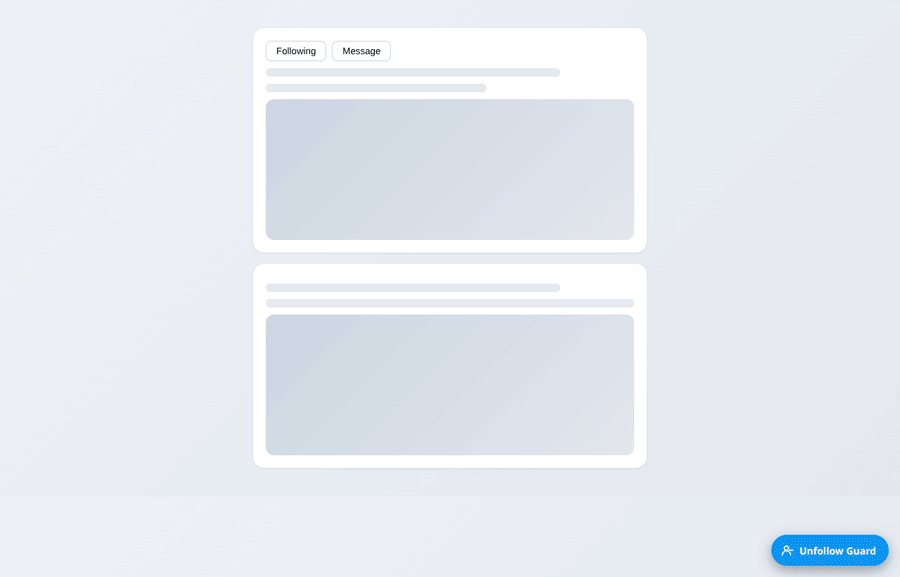
<br><sub><b>Scan → review → select → unfollow</b>, with live progress at the top of the page.</sub>

<br><br>

<table>
<tr>
<td align="center">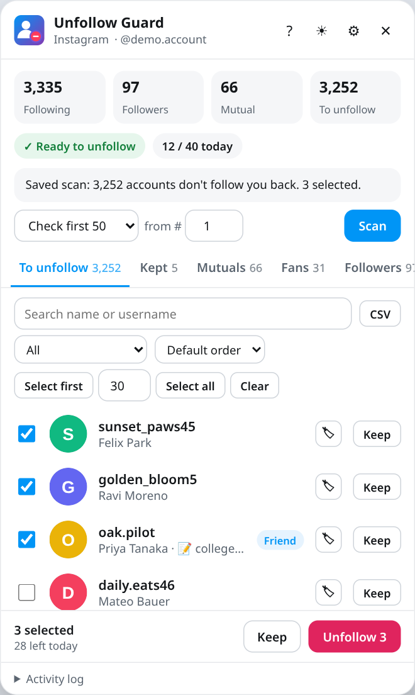<br><sub><b>Light theme</b></sub></td>
<td align="center">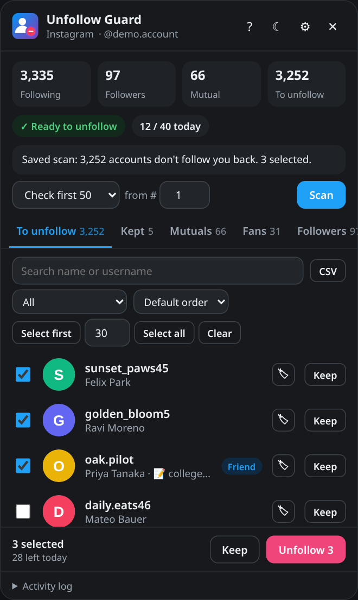<br><sub><b>Dark theme</b></sub></td>
</tr>
<tr>
<td align="center">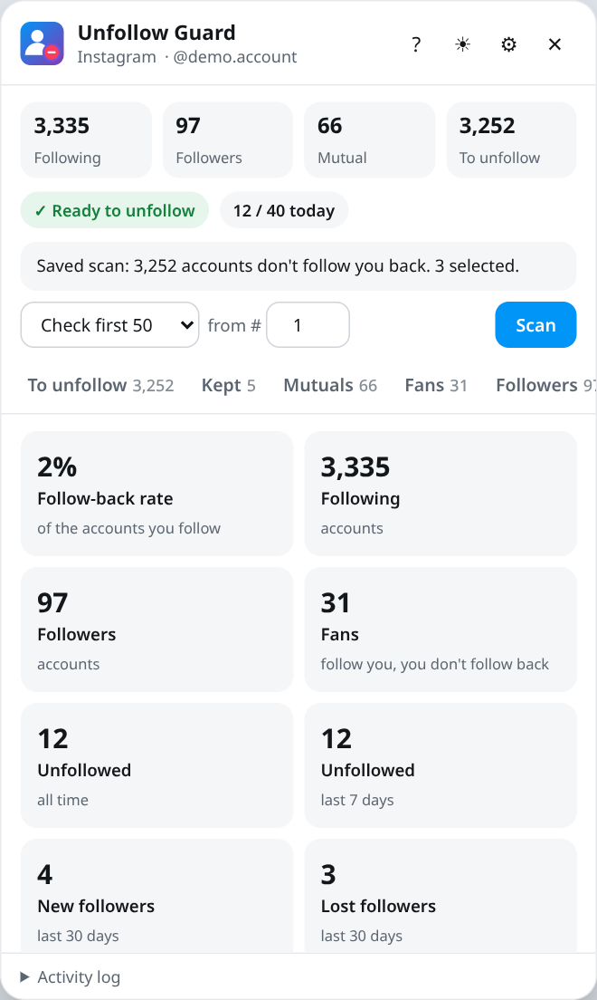<br><sub><b>Stats</b>: follow-back rate and unfollows per day</sub></td>
<td align="center">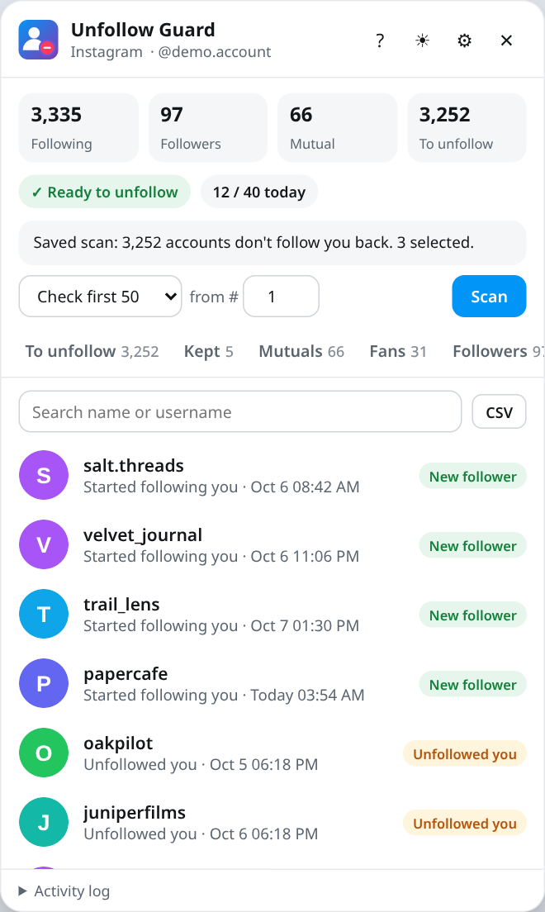<br><sub><b>Changes</b>: who unfollowed you, who followed you</sub></td>
</tr>
<tr>
<td align="center">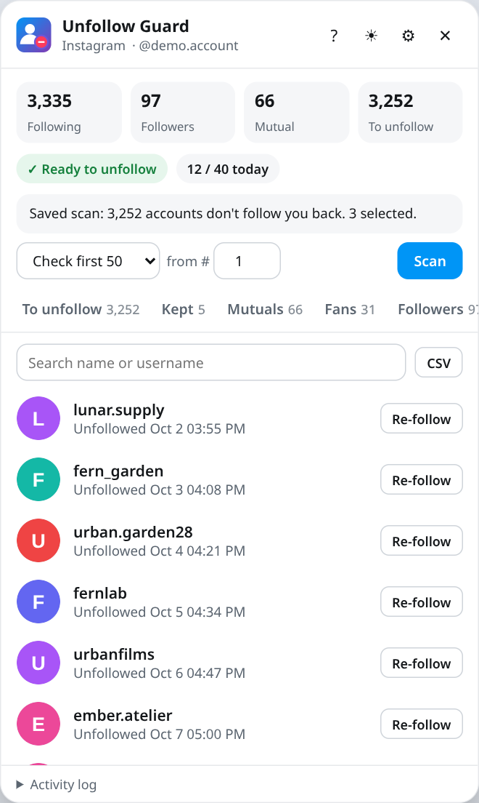<br><sub><b>Unfollowed</b>: history with a Re-follow button</sub></td>
<td align="center">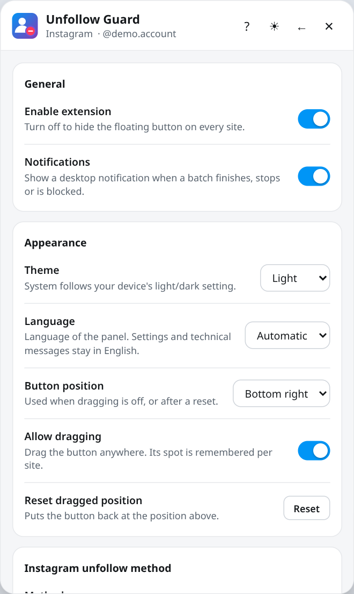<br><sub><b>Settings</b>: safety, themes, positions</sub></td>
</tr>
<tr>
<td align="center">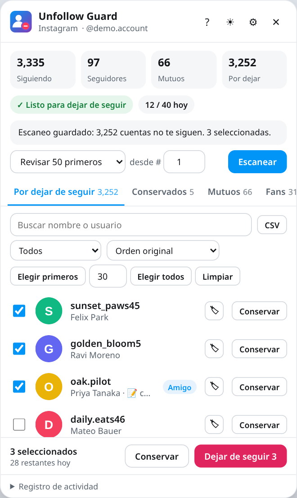<br><sub><b>Your language</b>: English, Español, Français, Deutsch, Português</sub></td>
<td align="center">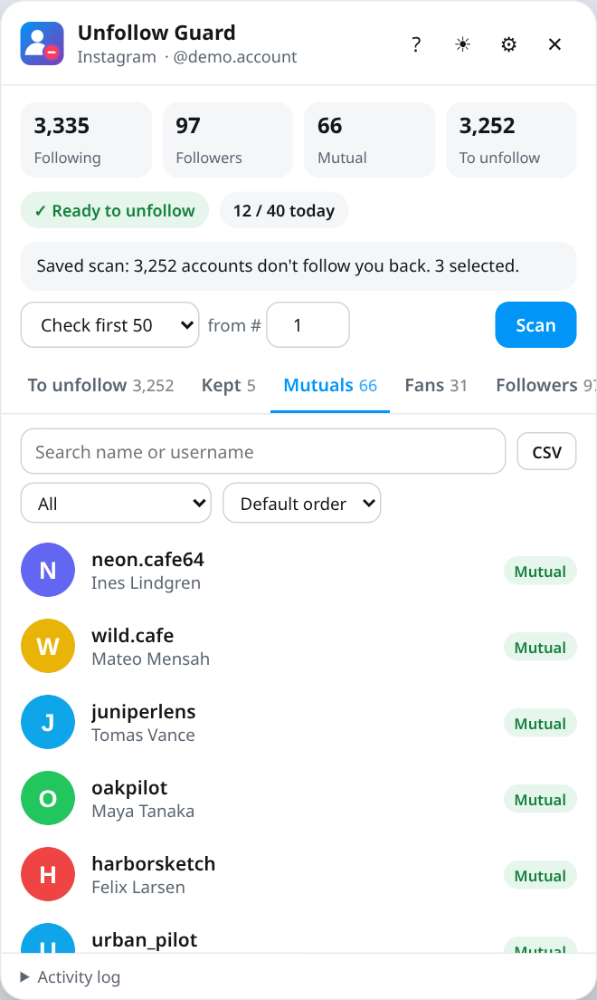<br><sub><b>Mutuals</b>, Fans, Followers and Following tabs</sub></td>
</tr>
</table>

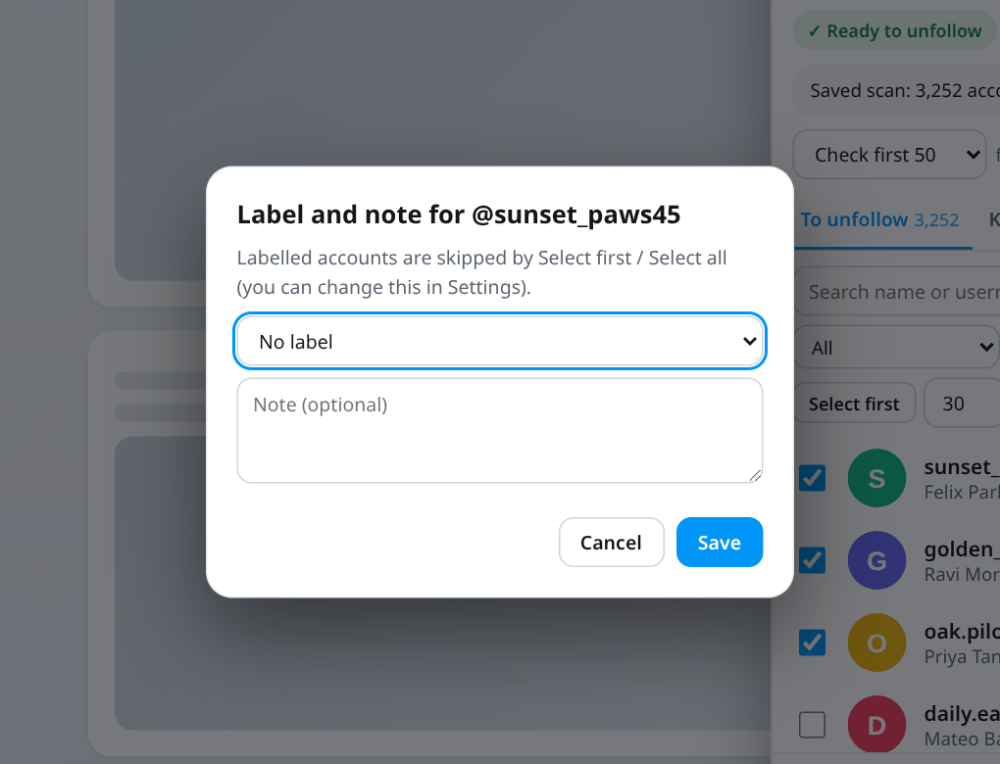&nbsp;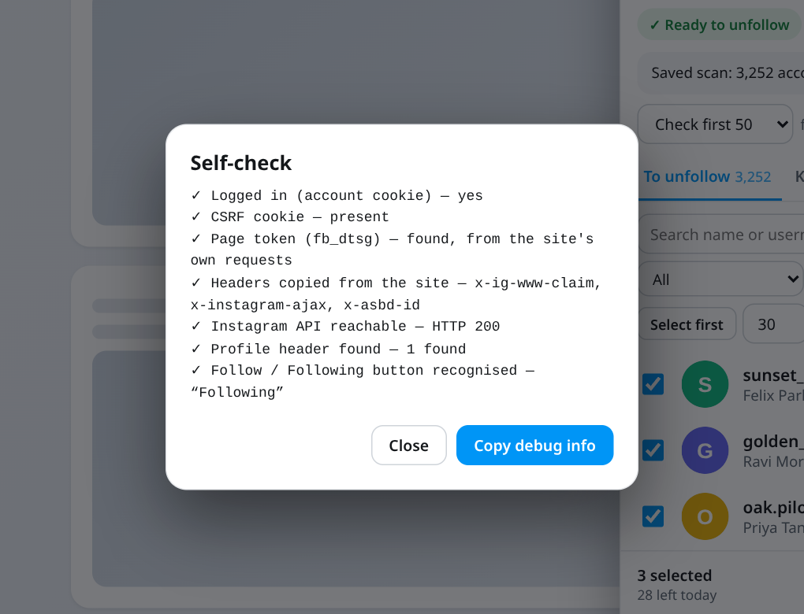&nbsp;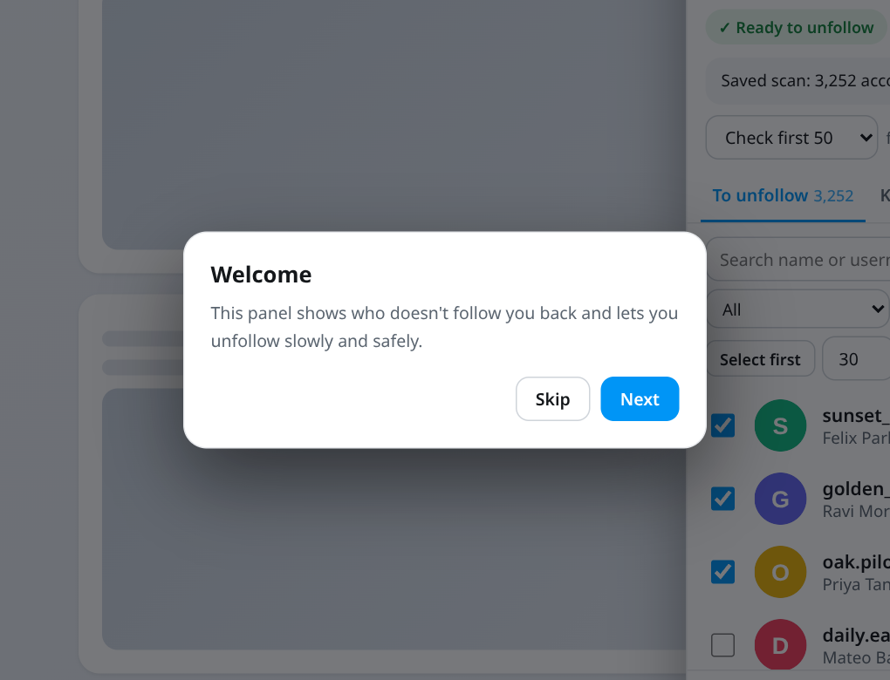
<br><sub>Labels and notes, the self-check with a copyable debug report, and the welcome tour.</sub>

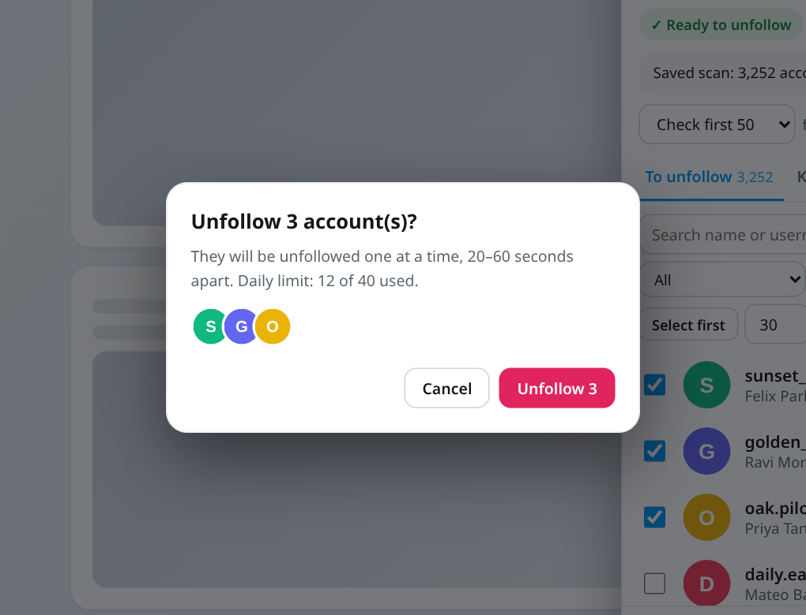&nbsp;&nbsp;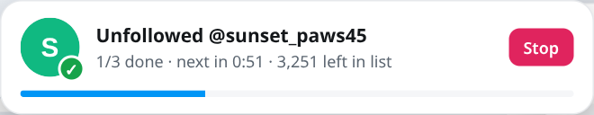
<br><sub>In-app confirmation dialogs (no native browser popups) and the progress card with avatar, username, countdown and Stop.</sub>

<sub><i>The screenshots and the GIF are rendered from the real interface with generated demo data. No real accounts appear in them.</i></sub>
</div>

## ✨ Features

### 🔍 Find the non-followers
- **One-click scan** that compares your following list with your followers.
- **Scan only what you need**: the first 50 / 100 / 250 / 500 accounts you follow, or all, with a **"from #"** offset to continue where you stopped.
- **Accurate by design**: a partial following list is always compared against your *complete* followers (or each account is checked individually when you have a very large audience), so nobody who follows you is ever listed by mistake.
- **Follower changes**: every full scan is compared with the previous one, so you can see **who unfollowed you** and who followed you. A followers list that looks incomplete (it doesn't match Instagram's own count) is never compared, so nobody is reported as lost by mistake.
- **Scan lock**: after every scan the button locks itself, so an accidental double-click can't send hundreds of requests. Unlock it deliberately in the settings.
- **Separate data per account**: scans, kept lists, history and counters are stored for each logged-in account, so switching accounts never mixes them up.

### 🗂 Everything in tabs

| Tab | What you see |
| --- | --- |
| **To unfollow** | Accounts that don't follow you back, with checkboxes. |
| **Kept** | Accounts you chose never to unfollow. They stay out of every future scan and can be moved back at any time. **Backup** / **Import** buttons save and restore this list. |
| **Mutuals** | People you follow who follow you back. |
| **Fans** | People who follow you that you don't follow. |
| **Followers** | Everyone who follows you (and whether you follow them back). |
| **Following** | Everyone you follow (and whether they follow you back). |
| **Unfollowed** | Your history of accounts unfollowed with the extension, with date and time and a **Re-follow** button (Instagram). |
| **Changes** *(Instagram)* | **Who unfollowed you** and **who started following you** since your previous scan. |
| **Stats** | Follow-back rate, totals, new/lost followers over 30 days and a chart of unfollows per day. |

Lists render in chunks, so even thousands of rows stay smooth. Every tab has search and a **CSV** export button, and the header shows live **Following / Followers / Mutual / To unfollow** counters.

### 🛡 Unfollow with guard rails
- **Daily limit** (default 40 on Instagram, 20 on Facebook, max 100): you *can't select more accounts than you have left today*.
- **Warm-up mode** (optional): start with a small limit and raise it every day you use the extension.
- **Protection rules** (optional): bulk selection skips **verified** accounts, **private** accounts, accounts matching **username patterns** (`*_official, shop*`), accounts you gave a **label**, and accounts you **recently started following**.
- **Filters and sorting**: show only private / public / no-profile-picture / verified / labelled accounts, sorted A→Z, Z→A or by full name. Select first / Select all respect the filter.
- **Labels and notes**: tag an account as Friend, Family, Client, Work or Other and add a short note. Labelled accounts are protected from bulk selection and included in CSV exports and Backups.
- **Random delay** between unfollows (default 20–60 s).
- **Selections persist** across tab refreshes, browser restarts and reboots.
- **Undo** on Keep, so a mis-click is one tap to fix.
- **Keep button** on every row, plus **Keep selected** in bulk.
- **Time-left chip**: "Next unfollow in 0:48", "Ready to unfollow", "Daily limit reached · resets in 5h 12m", "Cool-down · 5h left" or "Outside active hours".
- **Stop button** that works instantly, even between page loads.
- **Stops by itself** on rate limits, action blocks, logouts, or after three failures in a row.
- **Cool-down after a block** (default 6 h): if the site blocks or rate-limits an action, unfollowing is paused for hours, even after a browser restart. You can end it early, after a warning.
- **Active hours** (optional): a batch only runs inside the time window you choose (windows that cross midnight, like 22:00–06:00, work too) and waits for it to open.
- **Activity log** that records every ✓ and ✗ with the reason.
- **Self-check and debug report**: one button reports what the extension can currently see on the page (login, page token, copied headers, API reachability, button detection), and another copies a report you can share. Cookies, tokens and usernames are never included.
- **Live progress card** with the avatar and username of the account being processed, and of the one just unfollowed.

### 🎨 Polished experience
- Custom in-page dialogs (no native browser popups), with keyboard focus kept inside and returned afterwards.
- **Five interface languages**: English, Español, Français, Deutsch and Português, chosen automatically from your browser or set in the settings. The Settings screen, the Stats screen and technical messages stay in English.
- **Desktop notifications** when a batch finishes, stops or is blocked (optional), and a **toolbar badge** with today's count (`OFF` when disabled, `COOL` during a cool-down).
- **Daily schedule** (optional): runs one batch a day at the time you choose while an Instagram tab is open, after a 20-second countdown you can cancel.
- **Keyboard shortcuts**: `Alt+Shift+N` shows or hides the panel (change it at `chrome://extensions/shortcuts`); inside the panel `/` searches, `[` and `]` switch tabs, `Esc` closes, `?` opens the tour.
- **Welcome tour** on first use (replay it with the `?` button).
- **Accessibility**: tab roles with arrow-key navigation, labelled buttons, live regions for status messages, a progress bar role, and focus trapping in dialogs.
- **Light, dark or system theme**, switchable from the panel header.
- **Draggable floating button**, or pin it to any corner from the settings.
- **On/off switch** in the toolbar popup. The icon shows an `OFF` badge while disabled.
- **Browser-click method in many languages**: English, Spanish, French, German, Portuguese, Italian, Dutch, Turkish, Indonesian, Russian, Japanese, Korean and Hindi labels are built in; any other language can be added in the settings.
- Responsive layout that opens next to the button and never leaves the screen.

## 🚀 Installation

The extension isn't on a store; you load it as an unpacked extension. It works in **Chrome, Brave, Edge, Opera and other Chromium browsers (version 111 or newer)**.

1. **Download** this repository (or the zip) and **unzip** it somewhere permanent. Chromium remembers the folder, so don't move or delete it afterwards.
2. Open `chrome://extensions` (or `brave://extensions`, `edge://extensions`).
3. Turn on **Developer mode** (top-right).
4. Click **Load unpacked** and select the project folder (the one that contains `manifest.json`).
5. *(Optional)* Pin the extension from the puzzle-piece menu so the toolbar popup is one click away.
6. Open [instagram.com](https://www.instagram.com) or [facebook.com](https://www.facebook.com) and **refresh the tab**. A blue **Unfollow Guard** button appears in a corner.

> [!TIP]
> **Updating:** unzip the new version over the old folder, click the ↻ reload icon on the extension card, then **refresh your Instagram/Facebook tab**. Your saved scans, kept accounts and history stay in place.

### 🦊 Firefox (experimental)

`python3 scripts/build.py` writes `dist/unfollow-guard-firefox.zip`, a package whose manifest uses a background script instead of a service worker and a Gecko add-on id (Firefox **128+**). Load it from `about:debugging` → *This Firefox* → *Load Temporary Add-on*. **This build has not been tested**; please report what you find.

## 🧭 Quick start

1. **Open the panel**: click the floating **Unfollow Guard** button (drag it wherever it doesn't get in the way) or press `Alt+Shift+N`.
2. **Scan**: choose how many accounts to check (for example *first 50*), then press **Scan** and confirm.
3. **Review**: go through **To unfollow** (and check **Changes** to see who unfollowed you since last time). Press **Keep** on anyone you never want to unfollow, and look at **Mutuals**, **Fans** and **Stats** for the full picture.
4. **Select**: tick accounts by hand, or use **Select first** / **Select all** (limited to what's left of today's limit, and skipping protected accounts if you enabled that).
5. **Unfollow**: press **Unfollow N** and confirm. A progress card appears at the top of the page. Press **Stop** whenever you like.
6. **Come back tomorrow**: the counter resets at local midnight. To check the next batch, set **from #** to where you stopped, unlock **Allow scanning** in ⚙ Settings, and scan again.

## 🧠 How it works

### Scanning

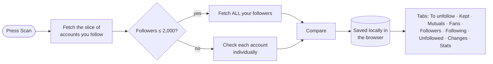

Instagram's web app talks to its own JSON endpoints. The extension reads the same lists, from inside your logged-in session, at a gentle pace (pauses of 1–3 seconds between pages).

### Unfollowing

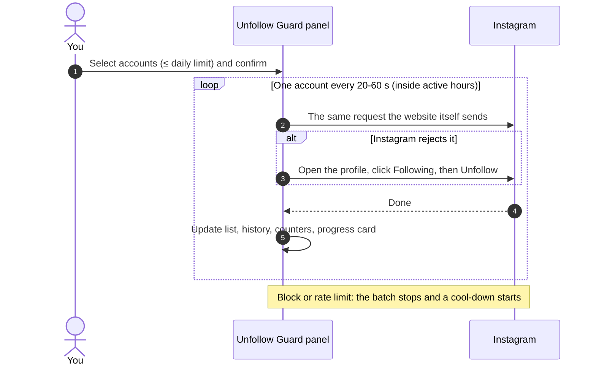

Two unfollow methods are available (⚙ Settings → *Instagram unfollow method*):

| Method | How it works | When to use it |
| --- | --- | --- |
| **Direct API** *(default)* | Sends the same request Instagram's own page sends, including the page's current security tokens, which a tiny script (`hook.js`) copies from the site's own requests. | Fast and quiet. If Instagram rejects it, the batch **automatically switches to Browser clicks** and says so in the log. |
| **Browser clicks** | Opens each profile and clicks **Following → Unfollow** like a person. The page reloads for each account and the batch resumes by itself. | Most robust. The tab has to stay open. Button labels are matched in many languages; add your own in the settings if needed. |

### Resilience
- A batch **survives page reloads** and continues in the same tab. If the tab is closed for more than 5 minutes, the batch is abandoned rather than resuming unexpectedly.
- **Stop** is stored under its own key, so a running batch can never overwrite it.
- Large data (scan, lists) is cached in memory; small data (selection, kept, history, counters) is saved separately, so the interface stays fast.

## ⚙️ Settings

Open them from the **⚙** button in the panel or from the toolbar popup.

| Setting | Default | Description |
| --- | --- | --- |
| **Enable extension** | On | Hides the floating button everywhere when off. (Also on the toolbar popup.) |
| **Theme** | System | Light, dark, or follow the device. A quick-switch button is in the panel header. |
| **Button position** | Bottom right | Corner used when dragging is off, or after a reset. |
| **Allow dragging** | On | Drag the floating button anywhere; its spot is remembered per site. |
| **Notifications** | On | Desktop notification when a batch finishes, stops or is blocked. |
| **Language** | Automatic | Interface language of the panel. |
| **Instagram unfollow method** | Direct API | Direct API with automatic fallback, or Browser clicks only. |
| **Cool-down after a block** | 6 h | Pause unfollowing for this many hours after a block or rate limit (0 = off). |
| **Only unfollow during active hours** | Off | A batch waits until the window opens (your local time). |
| **Active hours** | 09:00 – 22:00 | The allowed window, used when the switch above is on. |
| **Protect verified accounts** | Off | Select first / Select all skip verified accounts. |
| **Protect private accounts** | Off | Select first / Select all skip private accounts. |
| **Protect labelled accounts** | On | Accounts with a label are skipped by bulk selection. |
| **Protect usernames matching** | empty | Comma-separated patterns, `*` matches anything: `*_official, shop*`. |
| **Protect recently followed** | 0 days (off) | Bulk selection skips accounts the extension first saw you following in the last N days. Instagram doesn't share follow dates, so this counts from your first complete scan. |
| **Daily schedule** | Off | Runs one batch a day at the chosen time (default 10:00, 20 accounts) if an Instagram tab is open; only within 3 hours after that time. |
| **Warm-up mode** | Off | Starts at *start* per day and adds *step* for every day you used the extension, up to your cap (defaults 10 and +5). |
| **Browser-click labels** | empty | Extra words for the "Following" button and "Unfollow" menu item, for languages that aren't built in. |
| **Allow scanning** *(per site)* | On → locks after a scan | Unlock to scan again. |
| **Daily unfollow cap** *(per site)* | 40 / 20 | 1–100 unfollows per day. Also limits how many accounts you can select. |
| **Delay between unfollows** | 20–60 s | A random value in this range is used each time. |
| **Saved scan** *(per site)* | – | Shows the saved scan of each account. **Clear** removes the saved lists. Kept accounts, unfollow history and the follower-change log are not affected. |

## 🛡 Safety & limits

The defaults are deliberately conservative. A few suggestions:

- **Start small.** A first batch of 10–20 accounts shows you how your account reacts. Warm-up mode does this automatically.
- **Stay at or below ~40 a day** on Instagram. Many more can trigger temporary blocks.
- **Don't run it all day.** Do a batch, then use Instagram normally, or set active hours.
- **If you see a block message**, stop for a day or two. The extension already stops on its own, starts a cool-down and tells you why.
- **Keep your real friends safe**: use **Keep** liberally, and check **Mutuals** and **Fans**.
- **Facebook is stricter**; keep its limit low (see [Facebook beta](#-facebook-beta)).

At the default 40 a day, clearing about 3,000 accounts takes around 75 days. That is the point: it is slow *on purpose*.

## 🔒 Privacy & permissions

Everything stays **on your computer**, stored separately for each Instagram/Facebook account you use. The extension has no server, no analytics and no accounts, and it never sends your data anywhere except to Instagram/Facebook themselves, as part of the actions you ask for. Exports (CSV, Backup) are plain files you save yourself.

| Permission | Why it is needed |
| --- | --- |
| `storage` / `unlimitedStorage` | Saves your scans, kept list, selection, history and settings in the browser's local extension storage. Big lists can take a few MB. |
| `notifications` | Optional desktop notifications (can be turned off in the settings). |
| Access to `instagram.com`, `facebook.com` | Required to show the panel and talk to those sites from your logged-in session. |

**About `hook.js`:** on Instagram a small script runs inside the page and *only observes* the site's own API requests to remember a few header values and the page token that the site itself uses (for example `x-ig-www-claim`, `fb_dtsg`). These values stay in the page and are used only to make the unfollow request look exactly like the site's own. They are never stored in your settings and never leave your browser.

You can inspect all of the code. There is no build step, no minification and no third-party dependency in the extension itself.

## 🧪 Facebook (beta)

Facebook support is a **beta feature and has not been tested much**. Facebook has no stable internal API like Instagram's, so the extension works on the page itself:

1. Open your profile's **Followers** tab and press **Collect followers**. The page scrolls by itself to load the list.
2. Open your **Following** tab and press **Collect following**.
3. The non-followers appear in the panel. Unfollowing is done by clicking the buttons on the **Following** tab.

Notes:
- Your **Followers** list only exists if *Who can follow me* is set to **Public** in your Facebook privacy settings.
- The "non-followers" list **includes Pages and public figures** you follow, since they never follow back. Review it before selecting.
- Facebook changes its page structure often; the page-matching code lives in [`facebook.js`](facebook.js) so it is easy to adjust. Text matching assumes an **English** interface.
- The default daily limit is **20**. The Changes tab and Re-follow are Instagram-only.

If something doesn't work, the **Activity log** and the browser console (`F12`) explain what the extension saw.

## 🧯 Troubleshooting

<details>
<summary><b>The floating button doesn't appear</b></summary>

- Refresh the Instagram/Facebook tab after installing or reloading the extension.
- Check the toolbar icon: if it shows an **OFF** badge, open the popup and switch **Enabled** on.
- Make sure you're on `www.instagram.com` or `www.facebook.com`.
</details>

<details>
<summary><b>I disabled the extension and can't get it back</b></summary>

Click the extension's icon in the browser toolbar and switch **Enabled** on. (Pin the extension from the puzzle-piece menu if you can't see it.)
</details>

<details>
<summary><b>"Scan locked"</b></summary>

By design: the scan locks after each run to prevent accidental repeats. Open ⚙ Settings, turn on **Allow scanning** for that site, then scan again.
</details>

<details>
<summary><b>"Cool-down is active"</b></summary>

The extension saw the site block or rate-limit an action and paused unfollowing (default 6 hours). The chip at the top shows the time left. Waiting is the safest option; you can end the cool-down early from the dialog, or change its length under ⚙ Settings → Safety.
</details>

<details>
<summary><b>The Changes tab is empty</b></summary>

The first full scan only saves a baseline. After your next scan, new followers and people who unfollowed you appear there. Scans that fetch your complete followers list are compared; if the list looks incomplete, the comparison is skipped for that scan.
</details>

<details>
<summary><b>Direct API unfollow gets rejected</b></summary>

The batch switches to Browser clicks automatically. If you want to avoid the attempt, choose **Browser clicks** in the settings. If neither works, check the Activity log and make sure you refreshed the tab after updating the extension (the helper script only starts when a page loads).
</details>

<details>
<summary><b>Browser clicks can't find the Following button</b></summary>

Many languages are built in. If yours isn't, the error message lists the buttons it saw on the profile; copy the words for **Following** and **Unfollow** into ⚙ Settings → *Browser clicks · other languages*. Also make sure the account still exists and you actually follow it.
</details>

<details>
<summary><b>The scheduled batch didn't run</b></summary>

It only runs while an Instagram tab is open, between the set time and 3 hours after it, once per day, and only if there is something to unfollow, the daily limit isn't used up, no cool-down is active and you're inside your active hours. Cancel during the countdown skips that day.
</details>

<details>
<summary><b>The interface is in the wrong language</b></summary>

Pick a language under ⚙ Settings → Appearance → Language (or leave it on Automatic to follow the browser). The Settings screen, Stats and technical messages are English only.
</details>

<details>
<summary><b>Something doesn't work and I need to report it</b></summary>

Open the panel, expand **Activity log**, press **Self-check** and then **Copy debug info**. The report contains settings, counts and recent log lines, but no cookies, tokens or usernames.
</details>

<details>
<summary><b>Profile pictures show a letter instead</b></summary>

Instagram's image links expire after a few days. Scan again to refresh them. Names and actions are unaffected.
</details>

<details>
<summary><b>Mutuals / Fans / Followers tabs are empty</b></summary>

Those lists are filled by a scan. If you have more than 2,000 followers and scanned a limited range, followers aren't fetched (each account is checked individually instead). Use **Check → all** for the full lists.
</details>

## ℹ️ Known limitations

- **Everything was tested in a simulated browser, not on live Instagram or Facebook.** Neither site offers a test environment, so expect to adjust things the first time you use a feature.
- **Facebook (beta) and the Firefox package are untested** against real accounts.
- **Translations** (Spanish, French, German, Portuguese) were written without review by native speakers; corrections are welcome. The button words used by *Browser clicks* for other languages are best effort and can be overridden in the settings.
- **"Recently followed"** is an approximation (Instagram doesn't expose follow dates). An "accounts you've interacted with" rule isn't possible for the same reason.
- **The daily schedule** only works while a tab is open; the browser can't start unfollowing by itself.
- **Private / no-picture filters** need data from a scan made with this version; accounts from older scans have no such flags until you scan again.

## 📁 Project structure

```text
.
├── manifest.json            # Manifest V3 definition, permissions, shortcut and content scripts
├── background.js            # Service worker: toolbar badge, desktop notifications, keyboard shortcut
├── hook.js                  # Runs in the Instagram page (MAIN world): observes the site's own request headers/tokens
├── shared.js                # Settings, storage helpers, dialogs, theme + shared styles and the settings form
├── i18n.js                  # Interface translations (en, es, fr, de, pt) and the t() helper
├── instagram.js             # Instagram adapter: scan, direct API unfollow/follow, browser clicks (multi-language), self-check
├── facebook.js              # Facebook adapter (beta): collect lists by scrolling, unfollow by clicking, self-check
├── content.js               # The panel UI: tabs, filters, labels, selection, keep/undo, stats, progress card, batch loop, schedule, tour
├── popup.html / popup.js    # Toolbar popup: enable switch and settings
├── adapters/_template.js    # Skeleton for supporting another site
├── icons/                   # Extension icons (PNG + SVG source)
├── docs/                    # README artwork, the demo GIF and ADDING-A-SITE.md
├── scripts/
│   ├── build.py             # Builds the Chromium and (experimental) Firefox packages into dist/
│   └── screenshots/         # Renders the screenshots and GIF from the real UI with demo data
├── tests/                   # Automated tests (jsdom): panel, new features, unfollow flows, languages, adapter interface, popup
├── LICENSE                  # MIT
└── README.md
```

Each site is an **adapter** that exposes the same small interface (`scan`, `unfollow`, `follow`, `canScan`, `navigateTo`, `accountId`, `diagnose`, …). Supporting another site means adding one file and registering it; see [`docs/ADDING-A-SITE.md`](docs/ADDING-A-SITE.md) and [`adapters/_template.js`](adapters/_template.js).

## 🛠 Development

The extension has **no build step**: edit the files and reload. Dev tooling (tests, screenshots) is optional.

```bash
# run the extension from source
#   1. edit any file
#   2. chrome://extensions  →  ↻ reload the extension
#   3. refresh the Instagram / Facebook tab

npm install          # dev tools only: jsdom, puppeteer-core, @sparticuz/chromium
npm test             # runs the automated tests (simulated browser, no network)
npm run check-brand  # fails if the old product name reappears (also enforced by CI on every push/PR)
npm run build        # dist/unfollow-guard-chromium.zip and ...-firefox.zip
npm run screenshots  # re-renders docs/screenshots and docs/demo.gif (needs pillow: pip install pillow)
```

Tips:
- Console messages are prefixed with `[Unfollow Guard]`.
- All data lives in `chrome.storage.local`, under keys like `nfb_<name>_<site>_<accountId>`. Inspect it from the extension's service-worker console with `chrome.storage.local.get(null, console.log)`.
- To add a language, add a column to `ROWS` in `i18n.js` (a test checks that every key exists in every language and that placeholders match).
- Avoid naming top-level variables in extension pages after window properties (`top`, `name`, `status`…); they can stop a script from running.
- The tests cover the panel, scanning, follower changes, cool-down, active hours, warm-up, protection rules, filters, labels, undo, schedule, notifications, the toolbar badge, keyboard, tour, accessibility attributes, self-check, re-follow, export/import, translations and the browser-click method in several languages. They run against a simulated browser, **not** against live Instagram or Facebook.

## 🗺 Roadmap

- [x] Separate data for each logged-in account
- [x] **Changes** tab: who unfollowed you / who followed you
- [x] Cool-down after a block, and optional active hours
- [x] Re-follow button, export (CSV, Backup) and import of the kept list
- [x] Browser clicks in many languages, plus custom labels
- [x] Protection rules (verified, private, labelled, username patterns, recently followed) and warm-up mode
- [x] **Fans** tab, statistics, filters and sorting, labels and notes, undo
- [x] Interface translated into Spanish, French, German and Portuguese
- [x] Daily schedule, keyboard shortcuts and a welcome tour
- [x] Toolbar badge and desktop notifications
- [x] Self-check and copyable debug report
- [x] Accessibility pass (roles, labels, live regions, focus handling)
- [x] Real screenshots, a demo GIF, a Firefox package *(experimental)* and an adapter template for new sites
- [ ] Verify the Facebook adapter and the Firefox build against real accounts
- [ ] Translate the Settings and Stats screens, and add more languages
- [ ] Review of the translations by native speakers
- [ ] Support for another site (the adapter template is ready; it needs someone who can test it)

## 🤝 Contributing

Issues and pull requests are welcome. For larger changes, please open an issue first to discuss what you'd like to change. Keep the guard rails (daily limit, delays, stop-on-block) intact; they are the point of the project. Please run `npm test` before opening a pull request.

## ⚠️ Disclaimer

This software is provided for personal use, **as is**, without warranty of any kind. You are solely responsible for how you use it and for any consequences for your accounts. It is an independent project and is not associated with Meta Platforms, Inc., Instagram or Facebook. All trademarks belong to their respective owners.

## 📄 License

Released under the [MIT License](LICENSE). Copyright © 2026 Mystic monk.

<div align="center">
<sub>Made with care for people who just want a tidier following list. 🧹</sub>
</div>
